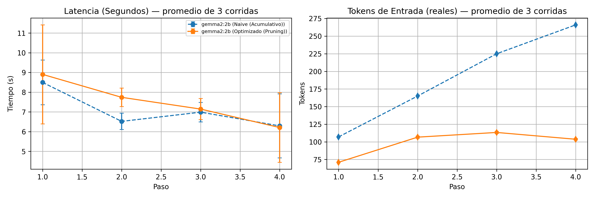

# Optimización de Agentes de Lenguaje de Código Abierto: Un Estudio de Caso sobre Latencia y Gestión de Estado con Gemma

[](https://www.dc.uba.ar/)
[](https://ai.google.dev/gemma)
[](https://ollama.com/)

Este repositorio contiene el código fuente, los scripts de benchmarking, los datasets sintéticos y los datos de rendimiento asociados al póster presentado en la **Second South American NLP School** (3 y 4 de agosto de 2026, Buenos Aires, Argentina).

---

## Resumen del Proyecto

Los tutoriales y prototipos educativos para agentes basados en LLM frecuentemente implementan una acumulación lineal del historial conversacional (*naive context stacking*). En entornos locales de producción y con hardware de consumo, este enfoque provoca un crecimiento descontrolado del uso de memoria, saturación de la ventana de contexto e inestabilidad operacional.

En este trabajo se evalúa cómo el modelo **Gemma 2 (2B)** ejecutado localmente a través de `Ollama`, comparando el pipeline tradicional frente a un pipeline optimizado mediante gestión de estado y poda de contexto (*Context Pruning*).

### Hallazgos Clave
- **61% de Ahorro en Tokens de Entrada:** El pipeline optimizado frena el crecimiento ilimitado de contexto, logrando una meseta en **104 tokens de entrada** en el cuarto paso, en comparación con los **266 tokens reales** del enfoque acumulativo lineal.
- **Rigor Metodológico:** Se aplicó un protocolo de *warm-up* (calentamiento de memoria), extracción de tokens reales de entrada (`prompt_eval_count`) y mediciones promediadas sobre **$N=3$ corridas independientes** con barras de error (desviación estándar).
- **Evidencia sobre la Barrera de Hardware:** La necesidad de modelos ultraligeros se constató empíricamente al intentar ejecutar Gemma 2 (9B) en hardware de consumo (Apple Mac), sufriendo un colapso de cómputo por falta de respuesta tras >30 minutos.

---

## Resultados y Visualización



> **Figura 1.** Comparativa de latencia promedio ($s$) y tokens de entrada reales reportados por la API de Ollama sobre $N=3$ corridas independientes (con barras de error). Mientras el pipeline tradicional escala linealmente hacia 266 tokens, el pipeline optimizado estabiliza el contexto en 104 tokens.

---

## Discusión Técnica y Lecciones Aprendidas

1. **Ahorro de Tokens vs. Latencia Real:** En modelos ultraligeros (2B), el tiempo total de respuesta (~6–8s) está dominado por la fase de generación autorregresiva de salida (*generation phase*), no por la fase de lectura de la entrada (*prefill phase*). Por ello, la reducción drástica de tokens de entrada no se tradujo en una ventaja de latencia estadísticamente significativa a esta escala (las barras de error se solapan en la mayoría de los pasos).
2. **Control de Estado:** El valor fundamental del *Context Pruning* no es la velocidad instantánea, sino la **sostenibilidad del sistema**, previniendo la degradación por desbordamiento de memoria a largo plazo.
3. **Trade-off de Precisión:** La poda agresiva del contexto estabiliza la infraestructura local a costa de una posible pérdida de memoria histórica lejana, lo que exige explorar capas de resumen semántico.

---

## Estructura del Repositorio

```text
.
├── README.md                      # Documentación principal
├── run_experiment.py              # Script principal del experimento (Warm-up + N=3 corridas)
├── requirements.txt               # Dependencias de Python
├── data/
│   ├── resultados_gemma_comparativo.csv  # Datos brutos por corrida y paso
│   └── resultados_gemma_promediado.csv   # Promedios y desviaciones estándar
└── figures/
    └── graficos_gemma_poster.png         # Gráfico

```
---

## Cómo Replicar el Experimento

### Requisitos Previos
1. Tener instalado [Ollama](https://ollama.com/download).
2. Descargar el modelo Gemma 2 (2B):
```
ollama pull gemma2:2b
```
>(Nota de infraestructura: Se intentó realizar la evaluación comparativa con Gemma 2 (9B) en hardware de consumo; tras >30 min de procesamiento continuo sin generación de respuesta completa, el experimento se descartó, confirmando la necesidad práctica de trabajar sobre la variante 2B en dispositivos locales).

---
### Pasos de Ejecución
1. **Clonar este repositorio:**
   ```bash
   git clone https://github.com/leslysandra/gemma-agent-nlp-optimizatio.git
   cd gemma-agent-nlp-optimization
   
2. **Instalar dependencias de Python:**
    ``
   pip install -r requirements.txt
   ``
3. **Ejecutar el benchmark:**
   ``
   python run_experiment.py
   ``

---

## Trabajo Futuro
**Escalabilidad a Gemma 2 (9B):** Evaluar el mismo pipeline sobre infraestructura con GPU dedicada para determinar si la reducción de tokens en el prefill genera un impacto estadísticamente significativo en la latencia a mayor escala de parámetros.

**Compresión Semántica Activa:** Reemplazar el truncado estático por un módulo de resumen recursivo utilizando la propia Gemma 2B para preservar la coherencia contextual a largo plazo.
   
